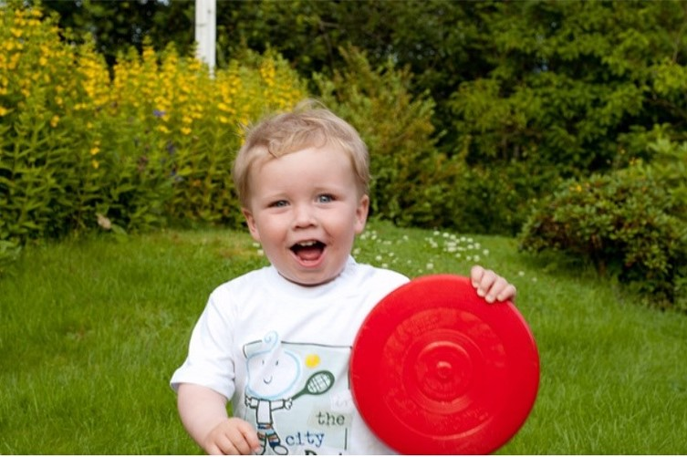

# 
<h1 align="center">
        Show&Tell
</h1>
<h4 align="center">
    <p>
        <b>English</b> |
        <a href="https://openi.pcl.ac.cn/Kayxxx/ShowAndTell/src/branch/master/README_zh.md">简体中文</a>
    </p>
</h4>
<h3 align="center">
    <p>Mindspore Implementation of "Show and Tell : Neural Image Caption Generation"</p>
</h3>


## Pre-requisites

* Mindspore=2.0.0
* Convolutional Neural Networks
* Long Short Term Memory Cells

## Usage
Clone the repo:
```bash
git clone https://openi.pcl.ac.cn/Kayxxx/ShowAndTell.git
```

### 1. Flickr8k Dataset 
* Prepare Dataset  ([**Flickr8k**](https://www.kaggle.com/shadabhussain/flickr8k)). 
* Extract and move images to a folder named **Images** and text to **captions.txt**. 
* Put the folder containing **Images** and **captions.txt** in a folder named **flickr8k** 
```angular2html
-- flickr8k
    |-- Images
      |-- 1000268201_693b08cb0e.jpg
      |-- ......
    |-- captions.txt
```

### 2. Training
* Run the following command : 
```bash
python train.py
```

### 3. Inference
* Run the following command : 
```bash
python inference.py --image_path <path_to_image> --model_path <path_to_model>
```
assets

### 4. Results
Some of the results obtained are shown below :
<p align="center">
  
</p>
<pre><code> Caption : a man is standing on top of a  mountain gazing at the sunset . </code></pre> 

Bad Case: 
<p align="center">
  
</p>
<pre><code> Caption : a young boy is holding a yellow ball. </code></pre> 


## References
* **Link**: [Show and tell: A neural image caption generator](https://arxiv.org/abs/1411.4555)
* **Link**: https://github.com/nalbert9/Image-Captioning