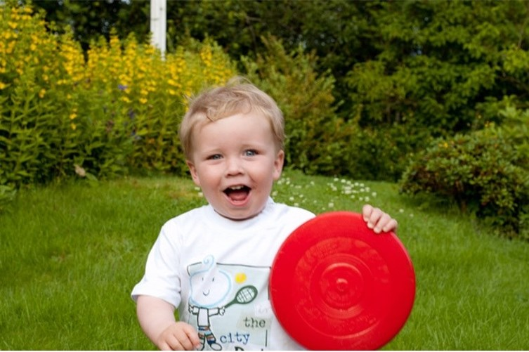

# 
<h1 align="center">
        Show&Tell
</h1>
<h4 align="center">
    <p>
        <b>简体中文</b> |
        <a href="https://openi.pcl.ac.cn/Kayxxx/ShowAndTell/src/branch/master/README.md">English</a>
    </p>
</h4>

<h3 align="center">
    <p>基于Mindspore实现Show and Tell: A Neural Image Caption Generator</p>
</h3>


## 必要前提

* Mindspore=2.0.0
* 卷积神经网络（Convolutional Neural Networks）
* LSTM

## 使用方法
克隆该仓库:
```bash
git clone https://openi.pcl.ac.cn/Kayxxx/ShowAndTell.git
```

### 1. Flickr8k Dataset 
* 准备数据集  ([**Flickr8k**](https://www.kaggle.com/shadabhussain/flickr8k)). 
* 提取图片到**Images**文件夹，提取文本到**captions.txt**文件. 
* 把**Images**and**captions.txt** 放到同一个文件夹（**flickr8k**）下 
```angular2html
-- flickr8k
    |-- Images
      |-- 1000268201_693b08cb0e.jpg
      |-- ......
    |-- captions.txt
```


### 2. 训练
* 运行如下代码 : 
```bash
python train.py
```

### 3. 推理
* 运行如下代码 : 
```bash
python inference.py --image_path <path_to_image> --model_path <path_to_model>
```

### 4. 结果
一些结果如下:
<p align="center">
  
</p>
<pre><code> Caption : a dog is running through the water. </code></pre> 

效果差: 
<p align="center">
  
</p>
<pre><code> Caption : a man in a red shirt is standing on a swing. </code></pre> 


## References
* **Link**: [Show and tell: A neural image caption generator](https://arxiv.org/abs/1411.4555)
* **Link**: https://github.com/nalbert9/Image-Captioning